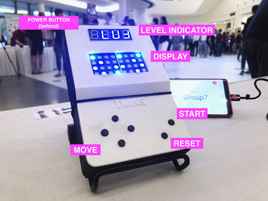

# Computation Structures 1D Project

## Introduction
Twins is a simple 1-player game, where the player has to move two particles to two end positions simultaneously. However, there is only one set of controls that controls both players. The challenge comes in guiding both particles through two different maps for player A and player B.

 
Figure 1: Artistic Vision of Twins

## Game description
Twins is a maze-based logic game.The plot of the game is that there are 2 robots stuck in a maze. The robots can only move onto empty spaces in the maze. In order to escape, they have to reach their exits at the same time. 
Using an LED matrix, two 4 by 4 maze maps will be displayed. The player’s goal is to guide the robots to their exits. There will only be 1 set of controls which moves both robots in each map simultaneously. The player will only win when both robots reach their respective exits at the same time. The game touches on the player’s cognitive flexibility, to solve 2 mazes at concurrently. 
Inspired by the idea of a gameboy, our hardware was designed to be intuitive, hence resembling the controls of a gameboy.

 
Figure 2: Final Build

## User Manual
Rules:
* Controls will move both robots on the maze
* Robots can only move onto empty spots
* Robots cannot move obstacles
* Both robots have the reach their exits together to win the level.
* When only 1 robot reaches the exit, it is a lose and the level will restart. 
 
How to play:
1. On the map selection screen, use the direction buttons to scroll through the different levels.
2. Press the ‘select’ button to choose a level. Now you’re ready to play the game!
3. Use the direction buttons to move the robots to the exit. Remember the rules of the game.
4. If you’re stuck, press reset to move the robots back to their starting positions.
Hint: Obstacles aren’t there to just block you. Use them to your advantage!

 
Video 1: Example of a Win  

 
Video 2: Example of a Lose

For more information our prototyping development please refer to our <a href="https://github.com/teezhiyao/1D_Twins_CI03_7/blob/master/Report.pdf/" title="report">
report</a>.

## Team Members
#### Tee Zhi Yao (1002845)
#### Tan Zhao Tong (1003031)
#### Ivan Chuang (1002744)
#### Ryan Yu (1002769)
